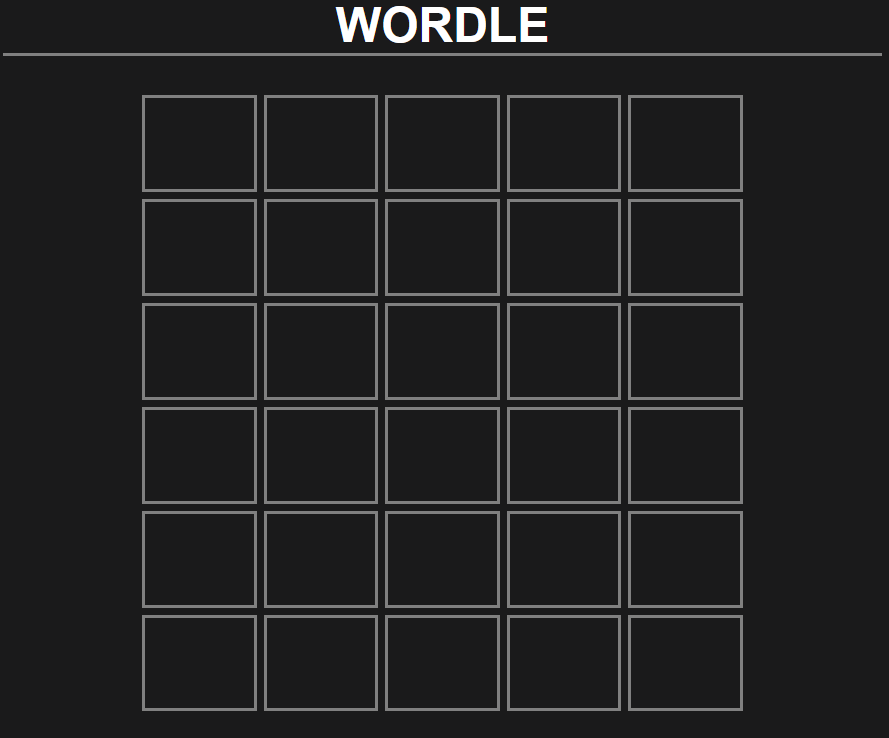

# Introduction
Now that this website is *basically* complete, I thought it would be a good opportunity to write about it and explain some of my decision processes. A lot of time, research, and learning went into this project, and I'm happy with how it turned out in the end. Although this is usually the last step, the first thing I'm writing about is the deployment process. *Why?* Well, initially this post was going to include the entire process of creating this website but I started writing about deployment because it's what I thought was the most interesting (and definitely the one I could recall my decision making processes the easiest). As it turns out, I can write a lot about the most mundane topics. Deployment is a huge topic; this article turned out much longer than I expected! Therefore, I have decided to split this article into pieces so each component can go more in-depth (when I eventually get around to doing them, anyway).

This article will cover the following topics:
- Hosting
    - Hosting Services
    - Domain Registrars
- Routing
    - Subdomains

<br><br>

# Hosting

## Hosting Services
Although you often need a domain in order to host things like websites and emails first, there are a few website hosting services that generate URLs to access websites instead. Because I still wasn't sure which domain I wanted, I decided to go this route and add a custom domain later. This limited the choices of hosting services I could use, but GitHub Pages and Vercel were both promising options (and most importantly free, albeit with restrictions) so I tried them both out. This is by no means a tutorial on each service, but rather an insight into my experiences with them - there are probably far better hosting services out there I never would have considered, but I just wanted one that worked how I wanted because the host can always move.

### GitHub Pages
GitHub Pages was the first hosting service that I tried. It's an extremely simple hosting service that is pretty much made for static websites like this one which are entirely composed of HTML, CSS, and JavaScript and maybe some calls to a REST API or two. As I already had a GitHub account (and was using it to [version control this very website](https://github.com/saacutter/website)), the earliest versions were hosted using GitHub Pages. Although this did work (this website is static after all), I did want some more features that weren't supported. 

Since it doesn't have a server, it couldn't support custom routes to access content in a more intuitive way. This meant that if I wanted routes like, for example, `/posts/<slug>/`, the necessary files had to be stored in the `/posts` directory. Although this *could* work, the file structure would be harder and harder to maintain as the number of files grew and there could be possible name collisions between files which I wanted to avoid as much as possible. This particular solution would mean that all of the rendered files would have to be saved to the GitHub repository, which I didn't want to do if possible because of the amount of clutter it would create. Because of this same limitation, making a REST API would likely be difficult if I ever needed/wanted one. 

This led me to search for other, more powerful hosting options. After some quick research, it seemed there was lots of positive reputation surrounding Vercel. Consequently, I decided to try it out and see what the hype was all about.

### Vercel
Vercel is a hosting service that, by comparison, allows for much more complex deployments with native support for several different frameworks, database integration, and more. Crucially, Vercel has support for deploying static websites, custom routing and has a free plan perfect for small-scale projects such as a personal website. Consequently, it was seemingly the perfect choice for deploying this website. Although Vercel is much more complicated than GitHub Pages because it has greater support for more technologies, it is still far simpler and easier to get running in comparison to some other hosting services like AWS.

Vercel has much better support for custom routes, which makes it an excellent choice for this project. It is a "serverless" service, which essentially just means that the server is only started when someone requests my website (using the closest server to them for quicker response times) allowing for these custom routes to be implemented. It also has better support for hosting multiple independent projects from different repositories without a paid account, which allowed some of my smaller projects to be hosted for demonstration in addition to this very website.

<br>

## Domain Registering
One of the most important components of a website is the domain. This was particularly difficult because of how many different combinations of domains there are. Domains consist of two main components - the second-level domain (the human readable recognisable part) and the top-level domain or TLD (the extension at the end). Because of this, domains like `example.com` and `example.net` are entirely separate domains that can be operated by different people/businesses/organisations (though, particularly for businesses, this isn't always true). Choosing a domain name would involve considering both components, as well as availability of any such domains.

### Choosing a Domain Name
Choosing which domain name I wanted was a more difficult task than expected. I had to be certain which domain name I wanted because I would have to pay for it for at least a year, and buying several domain names was off the cards because it isn't cheap (and rather irresponsible) to do that at all. I think I debated between different domain names for almost two months because I wanted to be completely sure before I just went off and bought one (just like anyone should. The domain names you're considering aren't likely to be sold any time soon, so take your time deciding on one). The second-level domain part was an easy decision at least. Being a portfolio site what better option than just my name? It's recognisable, distinct, and links directly to me - exactly what a portfolio *should* be doing. With that out of the way, the only other thing to decide was the top-level domain.

Choosing a TLD for my domain was probably what took the most debating because of how many TLDs there are. The Internet Assigned Numbers Authority (IANA), the authority which maintains all of the current TLDs, currently lists [over 1500 different TLDs](https://data.iana.org/TLD/tlds-alpha-by-domain.txt) which is a huge number. IANA also lists several types of TLDs, but the most applicable for me are generic TLDs (or gTLDs) and country-code TLDs (or ccTLDs, which are two-letter codes given to each country) because these are the most accessible and cheapest. 

It may seem weird to consider country-code TLDs, but these are often used by businesses because the two-letter code can be used to mean something else - [some governments will even lease them out](https://www.wix.com/encyclopedia/definition/tv-domain) to act as a source of revenue. Some of the most popular ccTLDs include `.io` (British Indian Ocean Territory) particularly in tech because of its relation to computer I/O, `.tv` (Tuvalu) because of its relation to television, and more recently `.ai` (Anguilla) has been growing in popularity (because, well...). After scrolling the list of ccTLDs, the only ones that were of interest to me were `.at` (Austria), `.as` (American Samoa), `.cd` (Democratic Republic of the Congo), `.cv` (Cape Verde), `.do` (Dominican Republic), `.io`, `.is` (Iceland), `.me` (Montenegro), and `.sh` (Saint Helena). There were a few others that caught my eye too, but they often required proof of residency in the country which is unfortunate. 

Of the gTLDs, the only ones I considered were the standard `.com`, `.net`, and `.org`, as well as the less common `.dev`, `.tech`, and `.xyz` (mostly because this TLD is extremely cheap). Out of all of these considerations, I felt that `.dev` would be the most appropriate for me. I am working toward being a software developer of some sort and wanted a portfolio website to post some of my projects online which is exactly what `.dev` is for, so it seemed like a perfect match (and, as you can see, *was* the perfect match).

### Choosing a Registrar
After choosing which domain name I wanted, the next step was to find a domain registrar that supported the `.dev` TLD which was just as hard as choosing the domain name to begin with. Historically, this TLD was used by developers to test applications. However, in 2018 it was purchased by Google (and handled by their registry) with public availability following soon after in 2019. After digging into some of the history of different domain registrars supporting the `.dev` TLD, it didn't seem like there were many that did initially (likely because Google was using Google Domains at the time). After [Google Domains was purchased by Squarespace in mid-2023](https://domains.google/), more registrars (such as Cloudflare) added support for some of Google's TLDs including `.dev`. Because of the various registrars I could use, I needed to start looking at the experiences that other people had with them.

The Internet Corporation for Assigned Names and Numbers (ICANN), the organisation which manages domain names and IP addresses, currently lists [over 3000 different registrars](https://www.icann.org/en/contracted-parties/accredited-registrars/list-of-accredited-registrars) which they have accredited. This is such an extreme number and I don't have the time to individually compare each and every registrar, so I needed to cut the number of options down significantly. After some (admittedly quick) research, there were a couple of registrars that repeatedly came up in discussions - GoDaddy, Namecheap, Cloudflare, and Porkbun (well, Google Domains was also mentioned quite a lot but there weren't any **recent** reviews). Narrowing it down to just four immediately was already a good start, but I could still only choose one so I investigated each one deeper (which was much more manageable compared to the potential >3000 options prior). 

After looking into each of them a little more, the general consensus for GoDaddy was to avoid them if possible. This varied from GoDaddy (allegedly) [upcharging and overall being expensive](https://www.reddit.com/r/sysadmin/comments/1cep85i/why_i_think_godaddy_is_the_worst_domain_provider/), [some predatory practices](https://www.reddit.com/r/Domains/comments/1jr3wxd/instant_regret_buying_my_domain_through_godaddy/), and [horrible customer support](https://www.reddit.com/r/sysadmin/comments/1nhojjb/im_shocked_at_how_bad_godaddy_is/). Although none of these reasons completely influenced my decision making (though I would be lying if I said they didn't), the other registrars seemed like much better deals for new customers.

The next one that was quickly dropped was Namecheap, who although had [significantly better reviews](https://www.reddit.com/r/software/comments/1gk4xb2/namecheap_review_should_i_use_it/) were [much more expensive](https://www.reddit.com/r/webdev/comments/1joud0k/your_opinions_on_namecheap/) compared to the other two registrars (by roughly USD$2.00, but this adds up over potentially many years). 

This narrowed down the choices to Cloudflare and Porkbun, but this was an extremely difficult choice since they share a lot of the same features (like including an SSL certificate, as HTTPS is required for `.dev` domains). Both are simply domain registrars which don't try to upsell products, have predatory practices, or make doing simple things a chore. In the end, I chose Porkbun to register my domain with and there were a few reasons for this. Although Porkbun domain registrations cost *slightly* more (and by slightly I mean a difference of USD$0.67), both services sell their domains "at cost" (with varying definitions of what the *actual* cost is) and they provide some features that were more enticing than Cloudflare's offerings. One of these features was full WHOIS privacy compared to just redaction. Although not much different, Cloudflare's WHOIS redaction service [still exposes the city/country of the registrant](https://developers.cloudflare.com/registrar/account-options/whois-redaction/) while Porkbun [completely hides all of these details](https://porkbun.com/products/whois_privacy). Another one of these features was the ability to use other nameservers, as Cloudflare locks domains registered with them to their own. Although I have no plans to change the nameservers (particularly since Porkbun's nameservers are [already using Cloudflare's](https://porkbun.com/products/dns_management)), having the complete inability to change them if I ever wanted/needed didn't seem like a great idea (especially when the general consensus on the internet is to split the hosting, registrar, and DNS). Porkbun is also [more involved with the community and its users](https://www.reddit.com/user/porkbunregistrar/) (even providing information to users not using them as a registrar) which gave me a much higher impression of them from a potential customer point of view than I had of Cloudflare. Regardless, if I ended up not being happy I could transfer my domain after 60 days anyway so I thought it was worth the gamble (and, in case you're wondering, it's been a great experience so far).

<br><br>

# Routing
For this website, I wanted custom routes for each aspect of the website for easier and more memorable access. Luckily, since I was using Vercel, I could achieve this using a `vercel.json` file. This is essentially a JSON file which configures and/or overrides various aspects of deployments on Vercel's servers. One of these aspects is routing, which when defined tells the Vercel server hosting my website what file to return when specific routes are accessed without the user having any knowledge. After reading the (weirdly long) [documentation](https://vercel.com/docs/project-configuration/vercel-json), the most obvious attributes for this purpose were `redirects`, `rewrites`, and `routes`. Although very similar to each other, there are some differences which I will get into a little later. Since I wanted the URL shown to the user to not change when using the routes (as it would otherwise kind of defeat the point of using routes in the first place), `rewrites` and `routes` were the most obvious choices as `redirect` changes the source URL (meaning the route change is more obvious to the user).

Initial versions of this project used the `routes` attribute. Although `rewrites` is what I was actually looking for, I used the legacy `routes` instead because there were more help threads using it (and I *may* have misread the documentation and not realised it was legacy). In this initial version, there were only a few routes that I wanted. These routes were `/calculator` (to go to the [calculator demonstration](https://projects.isaacrutter.dev/calculator/)) and `/grades` (to go to the [grade calculator demonstration](https://projects.isaacrutter.dev/grades/)). To do this, the `vercel.json` file had the following structure:
```json
{
    "routes": [
        {
            "src": "/calculator/(.*)",
            "dest": "https://calculator-deployment.vercel.app/$1"
        },
        {
            "src": "/grades/(.*)",
            "dest": "https://grade-calculator-deployment.vercel.app/$1"
        }
    ]
}
```
To explain this structure a bit more, each route requires two attributes - the `src` attribute and `dest` attribute. The `src` attribute is the route itself, while the `dest` attribute tells the server where that route should go. I did have an issue with CSS/JavaScript file links not working correctly initially because they were relative, and this required some workarounds. To diagnose this issue, it is necessary identify the difference between relative paths and absolute paths. In short, relative paths are file paths which must **not** begin with a `/` character and retrieves files relative to the current directory. This means that if you are in the `/an/example` directory and you link a file as `directory/example.ext`, then the server will try and find the file at `/an/example/directory/example.ext`. Absolute paths, on the other hand, are file paths which **must** begin with a `/` character and read relative to the file system's root. This means that if you are in the `/an/example` directory and you link a file as `/directory/example.ext`, then the server will try and find the file at `/directory/example.ext` just like that. With this in mind, then knowing that the file links used relative paths should make the issue obvious - they were trying to retrieve the files from the filesystem's root instead of relative to the current location which obviously meant it couldn't find the files.

To fix this issue, the routes required a `/` character at the end to ensure that the relative files were being read relative to the route and not the root (to anyone reading this through a text-to-voice synthesiser, I promise those are different words). In order to actually retrieve the files, regexes were used. Since Vercel uses Perl Compatible Regular Expression syntax, it also had to be used here. The `src` attributes of both routes were appended with a `(.*)`, which represents 0 or more (`*`) characters which are not newlines (`.`) and wrapped in brackets to capture this group. The `dest` had this appended using `$n` syntax, which uses the `n`th captured group from the source. If any of this went over your head, then just be aware that it maps user-friendly URLs to file locations on the server for better user accessibility. This, finally, correctly routed the website the way I wanted. You might be asking yourself why I chose to do *this* instead of just making each link absolute, especially when this took a while to debug. Well, the short answer is because I'm lazy and if it meant I didn't have to do additional work later on then that's a win. The actual real-world benefit of this is that files can live anywhere on the filesystem while still having clean and user-friendly URLs (and this is particularly necessary for what we're about to get into). Therefore, this approach made the most sense for my particular application.

When it came time to add the routes for adding blog post functionality, it was primarily the same process. I wanted the routes to be in the form `YYYY/MM/DD/slug`, but there wasn't any particular reason for this other than it is what felt the most natural and organised while also being the easiest to implement with the deployment script (which I will speak more of in a future article).
```json
{
    "src": "/([0-9]{4})/([0-9]{2})/([0-9]{2})/(.*)",
    "dest": "/$1/$2/$3/$4.html"
}
```
This created routes in the form `/YYYY/MM/DD/slug`, with the destination residing in `/YYYY/MM/DD/slug.html`. This method did, however, cause issues for if I wanted to include images or other files in the post. I found that this could be worked around by including the `{"handle": "filesystem"}` attribute in routes to give precedence to files instead of routes. The following could then be added to the configuration file to make it work as expected:
```json
{
    "src": "^/([0-9]{4})/([0-9]{2})/([0-9]{2})/(.*)/(.*\\..*)$",
    "dest": "/blog/$1/$2/$3/$4/$5"
},
{
    "src": "^/([0-9]{4})/([0-9]{2})/([0-9]{2})/(.*)/$",
    "dest": "/blog/$1/$2/$3/$4/$4.html"
}
```
This meant that every post had to be stored in a subdirectory using the slug as its name, and checking for any files being requested in the same directory (done by literally just checking if there was a dot in request with no other validation because that was easiest). This actually worked better than expected and meant I could add whatever additional files I wanted to posts. For some fun, here's an image of an upcoming game:



You might have noticed already, but what if the user was to manually navigate to a path? It's not like it would be *that* uncommon to want to do this, for whatever reason a user may have. I did, in fact, handle this in some initial versions using `"src": "(.*)/`, but I kept running into issues doing this. Using JavaScript to select the view worked in most cases, but in this particular one meant that the view would never be selected. Therefore, I just decided to let Vercel error out instead because that gives a better indication to the user that something is wrong compared to a website that appears to be broken. Although I *currently* have no solution, I will no doubt eventually find one making this article outdated (if you're reading this and it does work, please email me to remind me to update this article - I can be pretty forgetful sometimes).

<br>

## Subdomains
Once I secured my domain, I decided to move my projects to the `projects` subdomain and games to `games` subdomain. There was absolutely no reason to do this because the routes worked fine, but I did it anyway just because I could. The problem with this approach? Vercel's support for having a route relocate to a subdomain isn't the best. My requirements for the implementation of this had to meet these requirements:
- require minimal setup
- not require a new GitHub repo to be setup (because the games are stored in the same repo as this website and I didn't want to move them)
- integrate with the current deployment
- allow the separately hosted projects to be accessed through a route
- use a different subdomain for certain routes which use files in the main deployment

As it turns out, there are various ways to do this. However, I found [this](https://vercel.com/kb/guide/vercel-reverse-proxy-rewrites-external) article from Vercel's knowledge base to be the most helpful. Essentially, all I needed to do was create a proxy for each subdomain. This could be done by creating a new Vercel project through the CLI that consisted of just a `vercel.json` file and used the `rewrites` attribute to redirect as necessary. 

To start out, I created the `games.isaacrutter.dev` subdomain. From there, I created a new Vercel project from the CLI consisting of an empty `vercel.json` so that I could access it from the dashboard. Adding the subdomain was the next step, which was just a quick configuration by adding a new CNAME record to the domain's DNS. From here, all that had to be done was actually rerouting the games to the subdomain. There are two main routes that I wanted for this subdomain - `/` to route to the games menu, and `/game/` to route to the games themselves. Luckily the games were already using `/game/` routes, so they could easily be transferred over to the new subdomain.
```json
{
    "rewrites": [
        {"source": "/:game/", "destination": "https://isaacrutter.dev/Projects/Games/:game/index.html"},
        {"source": "/:game/:path*", "destination": "https://isaacrutter.dev/Projects/Games/:game/:path*"},

        {"source": "/", "destination": "https://isaacrutter.dev/Projects/Games/menu.html"},
        {"source": "/:path*", "destination": "https://isaacrutter.dev/:path*"}
    ]
}
```
There are a few key differences between the syntax of `routes` and `rewrites`. Most obviously, this uses `source` (which is analogous to `src`) and `destination` (which is analogous to `dest`). Additionally, the regex paths in `rewrites` are instead matched using `:path` syntax. This also supports appending a `*` character to the end to represent several paths. Semantically, this is exactly the same as `(.*)` in routes, and both the `source` and `destination` attributes use the same syntax which makes creating routes slightly easier (although the `$n` syntax is quite nice, it can get confusing when you are matching quite a few components).

Although this works, you might have already noticed an issue with the way this is written. If you said it's because the static files are linked using absolute paths which can cause issues with the subdomain, then you would be absolutely correct! (and I am concerned why you would know this without further context). Indeed, because the JavaScript, CSS, images, and fonts used absolute paths to link to the pages, they weren't being loaded (likely because they were getting caught by the `/game/:path*` route) and hence trying to retrieve the files from the wrong location. The fix was relatively simple though, and just involved adding routes for each static folder specifically before anything (since Vercel matches routes in the order they are presented in the file until it finds a match):
```json
{
    "rewrites": [
        {"source": "/js/:path*", "destination": "https://isaacrutter.dev/js/:path*"},
        {"source": "/css/:path*", "destination": "https://isaacrutter.dev/css/:path*"},
        {"source": "/img/:path*", "destination": "https://isaacrutter.dev/img/:path*"},
        {"source": "/fonts/:font*", "destination": "https://isaacrutter.dev/fonts/:font*"},

        ...
    ]
}
```
Now the files all retrieve as expected, meaning that the [games.isaacrutter.dev](https://games.isaacrutter.dev) subdomain routing is complete.

Moving onto the `projects.isaacrutter.dev` subdomain, this followed a similar process to the `games` subdomain. The only difference was with the base route. Because there is no page to navigate projects like there is for the games, I instead decided to make it redirect to the homepage's project view ([isaacrutter.dev/?view=projects](https://isaacrutter.dev/?view=projects)). This could be done using the `redirects` attribute available since the browser URL changing didn't matter:
```json
"redirects": [
    {"source": "/", "destination": "https://isaacrutter.dev/?view=projects", "permanent": true},
    {"source": "/:path*", "destination": "https://isaacrutter.dev/?view=projects", "permanent": true}
]
```
Note the use of the `permanent` attribute for each entry. This is a Boolean attribute that only changes which status code is returned by the redirect, with `true` returning 308 (indicating a permanent move) and `false` returning 307 (indicating a temporary move). These are semantic for the purposes of my website (and the difference is invisible to users anyway) so it did not matter which value I chose, but other websites may be more selective because it can affect things like search engine optimisation (SEO) or API requests. Lucky me for not having to worry about this, I suppose.

To see the difference between how `redirects` and `rewrites` are handled, we can look at the responses generated by each type of HTTP request closer. This can be done by running `curl` with the `-I` option to retrieve only the headers (i.e. `curl -I https://example.isaacrutter.dev/`). Running this on `projects.isaacrutter.dev/` returns the following (redacted) response:
```bash
HTTP/2 308 
cache-control: public, max-age=0, must-revalidate
content-type: text/plain
date: [REDACTED]
location: https://isaacrutter.dev/?view=projects
refresh: 0;url=https://isaacrutter.dev/?view=projects
server: Vercel
strict-transport-security: max-age=63072000
x-vercel-id: [REDACTED]
```

Compare that with the output of running this on `projects.isaacrutter.dev/calculator/, which returns the following (redacted) response:

```bash
HTTP/2 200 
accept-ranges: bytes
access-control-allow-origin: *
age: 0
cache-control: public, max-age=0, must-revalidate
content-disposition: inline
content-type: text/html; charset=utf-8
date: [REDACTED]
etag: "74c4c2a3674576121effe3c454faec0c"
last-modified: [REDACTED]
server: Vercel
strict-transport-security: max-age=63072000; includeSubDomains; preload
x-vercel-cache: HIT
x-vercel-id: [REDACTED]
content-length: 2476
```

Each request returns slightly different HTTP response headers. `projects.isaacrutter.dev` returns a status code of 308, which directly aligns with the redirect. It also includes the `location` header where it will send all requests, which is `isaacrutter.dev/?view=projects` as expected. `projects.isaacrutter.dev/calculator/`, on the other hand, returns a status code of 200 indicating a successful request. This is also as expected because the `/calculator/` route is only being rewritten, so the Vercel server just responds directly with what was requested. It also lacks the `location` header (because it's already at the requested location) and some other headers specifying information to do with the page. This information doesn't actually mean much, but it can be used to test any routes that are created to ensure that they return the expected result for validation purposes.

Anyway, back on topic, after establishing the `rewrites` in the configuration file (which required some modifications from the `games` proxy since the projects were hosted separately), this subdomain also worked perfectly. At this point, the routing for the website was (finally) done and I could move onto other things (like writing this article).

<br><br>

# Closing Thoughts
Working on this website ended up being a lot more fun than I anticipated. There is a LOT that goes into so many aspects of web development that I was previously unaware of, and I respect anyone else who does this. I don't know if I would want to do this all over again (scope creep is a real thing), but if I did I would probably want to use a web development framework instead (that *seems* to be cool thing to do now, anyway). Anyway, this article has ended up being much larger than expected so I'll end it here. Good luck to anyone else working on a personal website (and don't do what I did, you'll probably regret it).